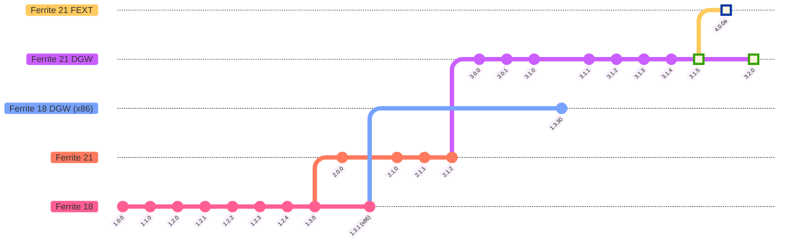

# ⚙️ Ferrite Core

### *Nodo completo + billetera Ferrite Core basado en Bitcoin Core 23.0 y el nuevo código base de Litecoin Core 21.2.2.*

**🌐 Idioma:** [🇬🇧 English](README.md) | **[🇨🇳 中文](README-zh.md)** | 🇪🇸 Español | [🇮🇳 हिंदी](README-hi.md)

---

## 🔴 Estadísticas de Red en Vivo

---

## 💬 Únete a la Comunidad

|  |  |  |  |
|:---:|:---:|:---:|:---:|
| [**Telegram**](https://t.me/ferrite_core) | [**r/Ferritecoin**](https://www.reddit.com/r/Ferritecoin) | [**Discord**](https://discord.gg/qKgF5xhS5p) | [**X / Twitter**](https://x.com/ferritecoin) |

---

## 📌 Enlaces Esenciales

> Explora billeteras, faucets y exploradores de bloques. Interactúa con la red Ferrite.

| 🔗 Recurso | Enlace | Descripción |
|---|---|---|
| 🌐 **Sitio Web** | [ferritecoin.org](https://ferritecoin.org) | Página oficial de Ferritecoin |
| 💳 **Billetera Web FEC** | [Principal](https://ferritecoin.org/wallet) · [Avanzada](https://ferritecoin.org/wallet_advanced) | Billetera de navegador nativa de Ferritecoin |
| 🪙 **Multibilletera** | [Abrir](https://ferritecoin.org/multiwallet) | Billetera multi-moneda — compatible con Bitcoin y Litecoin |
| 🚰 **Faucet** | [Reclamar FEC](https://ferritecoin.org/faucet) | Recibe Ferritecoins gratis para comenzar |
| 🔍 **Explorador de Bloques** | [explorer.ferritecoin.org](https://explorer.ferritecoin.org) | Transacciones en tiempo real, suministro y lista de ricos |
| 💬 **Mensajero FEXT** | [Abrir](https://ferritecoin.org/fext) | Interfaz de mensajería en cadena |
| 🛍️ **Merchandising** | [Tienda](http://shop.ferritecoin.org) | Tienda oficial de productos temáticos de Ferritecoin |

---

## 🚀 Lanzamientos

---

## 📱 Billetera Móvil

> **Ferrite Wallet para Android** - Lanzada el **21 de septiembre de 2024**

---

## 📣 Anuncios

> ⚠️ **Ferrite Core v3.0.0+** (desde abril de 2023) **no se ve afectado** por los cambios en la red y continuará operando con normalidad.

---

## 🏛️ Exchanges

> Opera con Ferritecoin en las siguientes plataformas. Compra, vende y mueve FEC a través de las redes compatibles.

| Exchange | Pares de Trading | Soporte de Red | Listado |
|---|---|---|---|
|  **[AnonEx](https://anonex.io/asset/FEC)** |  [**FEC/LTC**](https://anonex.io/market/FEC_LTC) ·  [**FEC/USDT**](https://anonex.io/market/FEC_USDT) |   | 2026-02-19 |
| 🔨 **Coinhana-FE** | *Próximamente* | — | — |

### 🤝 Trading OTC

| Plataforma | Par |
|---|---|
| <a href="https://discord.com/channels/859575137560297533/859831040213909554"> **Caldera**</a> | <a href="https://discord.com/channels/1066663020257882182/1107052872736198676"> **FEC OTC**</a> |

---

## 📈 Agregadores de Mercado

> Datos de precios en tiempo real, gráficos, clasificaciones e inteligencia de mercado para Ferritecoin.

| | Plataforma | Tipo | Descripción | Listado |
|---|---|---|---|---|
|  | [**CoinPaprika**](https://coinpaprika.com/coin/fec-ferrite) | Info | Precio y gráficos | 2023-02-16 |
|  | [**LiveCoinWatch**](https://www.livecoinwatch.com/price/Ferritecoin-FEC) | Info | Precio y gráficos | 2023-04-20 |
|  | [**CoinCodex**](https://coincodex.com/crypto/ferrite/) | Info | Precio y gráficos | 2023-04-29 |
|  | [**CoinCheckup**](https://coincheckup.com/coins/ferrite) | Info | Precio y gráficos | 2023-04-29 |
|  | [**CoinMarketLeague**](https://coinmarketleague.com/coin/feritecoin) | Info | Descripción general, enlaces y votación | 2023-05-18 |
|  | [**Blockspot**](https://blockspot.io/coin/ferrite/) | Info | Precio y gráficos | 2023-10-18 |
|  | [**Coinranking**](https://coinranking.com/coin/FB6AJAY69+ferritecoin-fec) | Info | Precio y gráficos | 2024-04-08 |
|  | [**Coincu**](https://coincu.com/crypto-price-prediction/fec-ferritecoin) | Info | Predicción de precios | 2024-06-29 |
| | [**Información de Trading**](https://github.com/koh-gt/ferrite-core/wiki/Trading-Information) | Wiki | Historial de precios, pares de trading y colaboradores | — |

---

## ⛏️ Minería

> Ferrite es mineable con soporte MWEB completo usando hardware basado en Scrypt.

| Recurso | Enlace | Descripción |
|---|---|---|
| 📊 **MiningPoolStats** | [Ferrite (FEC) Scrypt](https://miningpoolstats.stream/ferrite) | Visión general de hashrate y dificultad en vivo |
| 🏊 **Lista de Pools de Minería** | [GitHub Wiki](https://github.com/koh-gt/ferrite-core/wiki/Mining-Pools-List) | Directorio de pools Stratum |
| 🖥️ **Software CCMiner** | [Release v2.1.1](https://github.com/koh-gt/ferrite-core/releases/tag/v2.1.1) | Software de minería GPU |
| 🤖 **Alquilar Hardware ASIC** | [GitHub Wiki](https://github.com/koh-gt/ferrite-core/wiki/Rent-an-ASIC-miner) | Guía para alquilar mineros ASIC |
| 🚀 **Guía de Inicio Rápido** | [GitHub Wiki](https://github.com/koh-gt/ferrite-core/wiki/Getting-Started) | Guía de configuración de minería para principiantes |

---

## 📦 Ferrite Envuelto (wFEC)

> Lleva Ferrite a redes compatibles con EVM. Añade wFEC como token personalizado en **MetaMask** o **Trust Wallet**.

### 🔗 Direcciones de Contrato

| Token | Red | Dirección de Contrato |
|---|---|---|
|  |  **[BEP-20](https://bscscan.com/token/0xA846ab3673dfb3d27F81EcFe5BcA79c06120eE6D)** | `0xA846ab3673dfb3d27F81EcFe5BcA79c06120eE6D` |
| wFEC TON | **TON** | `EQCGQjLgjaSwzLezrRtKKelUwN4zpMVhNOrRjphELoAmGdoM` |
|  |  **ERC-20** | `Próximamente` |

### 💧 Pools de Liquidez y DEX

| DEX | Intercambio | Añadir Liquidez |
|---|---|---|
|  **PancakeSwap** | [Intercambiar WFEC (BEP-20)](https://pancakeswap.finance/swap?outputCurrency=0xA846ab3673dfb3d27F81EcFe5BcA79c06120eE6D) | [v3 WFEC/USDT — 1% Estrecho](https://pancakeswap.finance/liquidity/377069) · [v2 WFEC/USDT — 0.25% Amplio](https://pancakeswap.finance/v2/pair/0x55d398326f99059fF775485246999027B3197955/0xA846ab3673dfb3d27F81EcFe5BcA79c06120eE6D) |
|  **Uniswap** | [Intercambiar WFEC (BEP-20)](https://app.uniswap.org/#/swap?outputCurrency=0xA846ab3673dfb3d27F81EcFe5BcA79c06120eE6D) | [WFEC/USDT — 0.30% Amplio](https://app.uniswap.org/pools/55980) |
| **STON.fi** | *Próximamente* | [WFEC/USDT](https://app.ston.fi/liquidity/provide?ft=EQCGQjLgjaSwzLezrRtKKelUwN4zpMVhNOrRjphELoAmGdoM&tt=USD%E2%82%AE) · [WFEC/TON](https://app.ston.fi/liquidity/provide?ft=EQCGQjLgjaSwzLezrRtKKelUwN4zpMVhNOrRjphELoAmGdoM&tt=TON) |

---

## 🗺️ Hoja de Ruta de Versiones

---

## ⚡ Rápido. Gratuito. Ferrite.

---

## 📝 ¿Qué es Ferritecoin?

**Ferritecoin (FEC)** está diseñado para el mundo real. Está construido para microtransacciones frecuentes y de bajo costo donde cada fracción de centavo importa. Las tarifas de red están denominadas en 1/100.000.000 subdivisiones atómicas de FEC, garantizando que incluso las transferencias más pequeñas sigan siendo económicamente viables para todos, en todas partes.

La misión de Ferrite es simple: **democratizar el acceso a las criptomonedas** a través de la asequibilidad, la velocidad y la apertura.

### 🔒 Privacidad y Seguridad

Ferrite extiende la base de Bitcoin con tecnología de privacidad potente y battle-tested:

- **MWEB (Mimblewimble Extension Block)** es tomado de Litecoin. MWEB mejora la confidencialidad de las transacciones mediante agregación, ofuscación criptográfica y firmas ligeras. Las transacciones se vuelven privadas, compactas e imposibles de rastrear.

- **Dark Gravity Wave (DGW)** es adaptado de Dash. DGW es un algoritmo de ajuste dinámico de dificultad que mantiene tiempos de bloque estables de 1 minuto incluso bajo fluctuaciones extremas de hashrate, protegiendo la red contra la manipulación.

### 🗣️ Mensajería en Cadena Incensurable

Ferrite cuenta con una capa única de **mensajería de texto en cadena (FEXT)** que permite a los usuarios comunicarse de forma anónima, permanente y sin censura, directamente en la blockchain. Debido a que los mensajes se distribuyen a cada nodo y se almacenan para siempre, ninguna autoridad puede silenciarlos.

> FEC es la moneda de intercambio nativa de todo el ecosistema Ferrite.

---

## ✨ Características Destacadas

### 💬 Mensajería de Texto a Prueba de Censura

El texto inscrito en la blockchain se distribuye permanentemente a cada nodo. Inmutable, sin fronteras y gratuito.

Usa el mensajero [**Web FEXT**](https://ferritecoin.org/fext) para enviar mensajes privados en cadena al instante.

> 🛠️ Explorador de inscripciones disponible mediante **PowerShell** y **Python**.
>
> **Martensite** es una función próxima que permite transacciones FEXT OP_RETURN de un solo byte para complementar los ingresos por comisiones de los mineros por encima de los subsidios de bloque.

---

### ⏱️ Tiempos de Bloque de 1 Minuto
Las transacciones se propagan instantáneamente y se confirman en minutos.

### 🌊 Ajuste Dinámico de Dificultad *(activo después del bloque 250.000)*
La dificultad se recalibra **en cada bloque**, respondiendo en tiempo real a los cambios de hashrate:
- 📈 ¿Aumento repentino de hashrate? La dificultad sube rápido para proteger el suministro.
- 📉 ¿Caída de hashrate? La dificultad baja rápido para mantener la minería accesible.

### 🔢 Suministro Estrictamente Limitado
**Nunca** existirán más de **𝔽 60.221.400** FEC.

- Recompensa inicial por bloque: **𝔽 100**
- Intervalo de reducción a la mitad: cada **301.107 bloques** (~8 meses)
- 33 épocas de reducción a la mitad en total

[**→ Ver el suministro circulante actual**](https://explorer.ferritecoin.org)

### 💸 Tarifas de Transacción Casi Nulas
Las tarifas están denominadas en fracciones microscópicas de FEC, haciendo que cada transferencia, por pequeña que sea, sea económicamente razonable.

### 🌍 Totalmente Transparente
**Sin premine.** Los ejecutables de Linux se subieron a Telegram y Discord públicos desde el **bloque 120** (~2 horas después del lanzamiento), con migración completa a GitHub en el **bloque 3.000** (~50 horas).

### 🏛️ Verdaderamente Descentralizado
Ferrite no tiene dueño. **Los mineros gobiernan la red.** Punto.

### 🎭 Seudónimo por Defecto
No se requiere identidad. Nadie sabe quién posee o mueve las monedas a menos que *tú* elijas revelarlo.

Con **MWEB** activo desde el **bloque 150.000 (6 de julio de 2023)**, las transacciones pueden hacerse completamente confidenciales, lo cual es vital en una era de aplicación agresiva de KYC/AML.

### ⚙️ Algoritmo Scrypt | Compatible con ASIC y GPU
Reutiliza hardware de minería obsoleto de **Litecoin, Dogecoin o Ethereum Classic**. Originalmente resistente a ASIC por diseño, ahora compatible con los modernos ASIC Scrypt para máxima accesibilidad.

---

## 📐 Especificaciones Técnicas

### ⚙️ Protocolo

| Parámetro | Valor |
|---|---|
| **Fecha de Lanzamiento** | 22 de noviembre de 2022 |
| **Algoritmo** | Scrypt, Prueba de Trabajo |
| **Puerto RPC** | 9573 |
| **Puerto P2P** | 9574 |
| **Tiempo de Bloque** | 1 minuto |
| **Ajuste de Dificultad** | Cada bloque (DGW) |
| **Intervalo de Reducción a la Mitad** | 301.107 bloques |
| **Tiempo de Propagación** | ~5 segundos (8,3% de tasa de bloques huérfanos) |
| **Tamaño de Bloque** | 3,8147 MiB |
| **Rendimiento de Transacciones** | ~105 tx/s |
| **Premine** | ❌ Ninguno |

### 💰 Economía

| Parámetro | Valor |
|---|---|
| **Recompensa Inicial por Bloque** | 𝔽 100 |
| **Suministro Máximo** | 𝔽 60.221.400 |
| **Bloques con Recompensa** | 10.237.637 (33 reducciones a la mitad) |
| **Duración Mínima de Reducción a la Mitad** | ~209 días |
| **Vida Útil Total de Recompensas** | ~7.109 días (19,48 años) |

El suministro total a través de todas las épocas de reducción a la mitad está definido por:

$$\sum_{i=0}^{33} 301{,}107 \left(\frac{100}{2^i}\right) \approx 60{,}221{,}400$$

---

## 🔨 Coinhana *(En Desarrollo)*

---

## ℹ️ ¿Por qué "Ferrite Core"?

El **núcleo de ferrita** es uno de los componentes más subestimados en la electrónica. Barato, oculto y raramente mencionado. Sin él, los generadores, las antenas de radio y los interruptores de alimentación simplemente no funcionarían. Su secreto reside en una elegante combinación: **alta permeabilidad magnética** (permite que los campos magnéticos pasen libremente) combinada con **baja conductividad eléctrica** (eliminando las pérdidas por corrientes de Foucault). Todo esto logrado a un costo mínimo, sin preocupaciones de seguridad.

> *Bitcoin es oro digital. Litecoin es plata digital. Ferrite es ferrita.*
>
> En el mundo real, usamos monedas hechas de metales base ferrosos porque el oro y la plata son demasiado preciosos para circular — [Aristófanes](https://github.com/koh-gt/ferrite-core/wiki/About-Ferrite-Core#transaction-reports)

Ferritecoin está construido para ser la **moneda digital cotidiana**. Está diseñado para ser rápido, barato y accesible, especialmente para las poblaciones no bancarizadas en naciones en desarrollo que enfrentan costos de remesas exorbitantes.

> 🔷 El logotipo de la moneda Ferrite es el **símbolo de circuito IEEE-315 para una cuenta de ferrita**.

### ¿Qué hace especial a Ferritecoin en 2024?

- ✅ Protocolo de privacidad **MWEB** | tomado de Litecoin
- ✅ Algoritmo de dificultad **DGWv3** | adaptado de Dash
- ✅ Mensajería experimental en cadena OP_RETURN **FEXT**
- ✅ **Sin premine** | el 100% del suministro se mina de forma justa
- ✅ **Sin comisiones de desarrolladores, sin reservas de marketing, sin direcciones especiales**
- ✅ Todas las billeteras son iguales. Cada moneda minada va directamente al minero.

---

*Ferritecoin*

**[🌐 ferritecoin.org](https://ferritecoin.org)**

