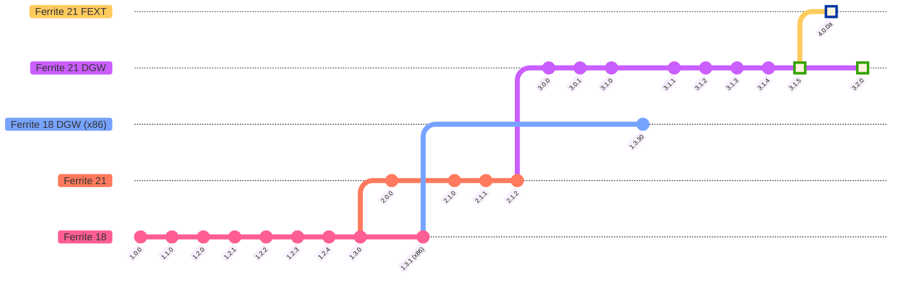

# ⚙️ Ferrite Core

### *Bitcoin Core 23.0 और नए Litecoin Core 21.2.2 कोडबेस पर आधारित Ferrite Core पूर्ण नोड + वॉलेट।*

**🌐 भाषा:** [🇬🇧 English](README.md) | **[🇨🇳 中文](README-zh.md)** | [🇪🇸 Español](README-es.md) | 🇮🇳 हिंदी

---

## 🔴 लाइव नेटवर्क आँकड़े

---

## 💬 समुदाय से जुड़ें

|  |  |  |  |
|:---:|:---:|:---:|:---:|
| [**Telegram**](https://t.me/ferrite_core) | [**r/Ferritecoin**](https://www.reddit.com/r/Ferritecoin) | [**Discord**](https://discord.gg/qKgF5xhS5p) | [**X / Twitter**](https://x.com/ferritecoin) |

---

## 📌 आवश्यक लिंक

> वॉलेट, फ़ॉसेट, ब्लॉक एक्सप्लोरर खोजें। Ferrite नेटवर्क के साथ इंटरैक्ट करें।

| 🔗 संसाधन | लिंक | विवरण |
|---|---|---|
| 🌐 **वेबसाइट** | [ferritecoin.org](https://ferritecoin.org) | Ferritecoin का आधिकारिक होमपेज |
| 💳 **FEC वेब वॉलेट** | [मुख्य](https://ferritecoin.org/wallet) · [उन्नत](https://ferritecoin.org/wallet_advanced) | Ferritecoin-नेटिव ब्राउज़र वॉलेट |
| 🪙 **मल्टीवॉलेट** | [खोलें](https://ferritecoin.org/multiwallet) | मल्टी-कॉइन वॉलेट — Bitcoin और Litecoin के साथ संगत |
| 🚰 **फ़ॉसेट** | [FEC प्राप्त करें](https://ferritecoin.org/faucet) | शुरुआत के लिए मुफ़्त Ferritecoin प्राप्त करें |
| 🔍 **ब्लॉक एक्सप्लोरर** | [explorer.ferritecoin.org](https://explorer.ferritecoin.org) | रियल-टाइम लेनदेन, आपूर्ति और रिच लिस्ट |
| 💬 **FEXT मैसेंजर** | [खोलें](https://ferritecoin.org/fext) | ऑन-चेन मैसेजिंग इंटरफ़ेस |
| 🛍️ **मर्चेंडाइज़** | [शॉप](http://shop.ferritecoin.org) | आधिकारिक Ferritecoin-थीम्ड मर्च स्टोर |

---

## 🚀 रिलीज़

---

## 📱 मोबाइल वॉलेट

> **Android के लिए Ferrite Wallet** - **21 सितंबर 2024** को जारी किया गया

---

## 📣 घोषणाएं

> ⚠️ **Ferrite Core v3.0.0+** (अप्रैल 2023 से) नेटवर्क परिवर्तनों से **अप्रभावित** है और सामान्य रूप से काम करता रहेगा।

---

## 🏛️ एक्सचेंज

> निम्नलिखित प्लेटफॉर्म पर Ferritecoin का व्यापार करें। समर्थित नेटवर्क पर FEC खरीदें, बेचें और स्थानांतरित करें।

| एक्सचेंज | ट्रेडिंग पेयर | नेटवर्क समर्थन | सूचीबद्ध |
|---|---|---|---|
|  **[AnonEx](https://anonex.io/asset/FEC)** |  [**FEC/LTC**](https://anonex.io/market/FEC_LTC) ·  [**FEC/USDT**](https://anonex.io/market/FEC_USDT) |   | 2026-02-19 |
| 🔨 **Coinhana-FE** | *जल्द आ रहा है* | — | — |

### 🤝 OTC ट्रेडिंग

| प्लेटफॉर्म | पेयर |
|---|---|
| <a href="https://discord.com/channels/859575137560297533/859831040213909554"> **Caldera**</a> | <a href="https://discord.com/channels/1066663020257882182/1107052872736198676"> **FEC OTC**</a> |

---

## 📈 मार्केट एग्रीगेटर

> Ferritecoin के लिए रियल-टाइम मूल्य डेटा, चार्ट, रैंकिंग और बाज़ार जानकारी।

| | प्लेटफॉर्म | प्रकार | विवरण | सूचीबद्ध |
|---|---|---|---|---|
|  | [**CoinPaprika**](https://coinpaprika.com/coin/fec-ferrite) | जानकारी | मूल्य और चार्ट | 2023-02-16 |
|  | [**LiveCoinWatch**](https://www.livecoinwatch.com/price/Ferritecoin-FEC) | जानकारी | मूल्य और चार्ट | 2023-04-20 |
|  | [**CoinCodex**](https://coincodex.com/crypto/ferrite/) | जानकारी | मूल्य और चार्ट | 2023-04-29 |
|  | [**CoinCheckup**](https://coincheckup.com/coins/ferrite) | जानकारी | मूल्य और चार्ट | 2023-04-29 |
|  | [**CoinMarketLeague**](https://coinmarketleague.com/coin/feritecoin) | जानकारी | अवलोकन, लिंक और वोटिंग | 2023-05-18 |
|  | [**Blockspot**](https://blockspot.io/coin/ferrite/) | जानकारी | मूल्य और चार्ट | 2023-10-18 |
|  | [**Coinranking**](https://coinranking.com/coin/FB6AJAY69+ferritecoin-fec) | जानकारी | मूल्य और चार्ट | 2024-04-08 |
|  | [**Coincu**](https://coincu.com/crypto-price-prediction/fec-ferritecoin) | जानकारी | मूल्य पूर्वानुमान | 2024-06-29 |
| | [**ट्रेडिंग जानकारी**](https://github.com/koh-gt/ferrite-core/wiki/Trading-Information) | Wiki | मूल्य इतिहास, ट्रेडिंग पेयर और योगदानकर्ता | — |

---

## ⛏️ माइनिंग

> Ferrite को Scrypt-आधारित हार्डवेयर का उपयोग करके पूर्ण MWEB समर्थन के साथ माइन किया जा सकता है।

| संसाधन | लिंक | विवरण |
|---|---|---|
| 📊 **MiningPoolStats** | [Ferrite (FEC) Scrypt](https://miningpoolstats.stream/ferrite) | लाइव हैशरेट और कठिनाई अवलोकन |
| 🏊 **माइनिंग पूल सूची** | [GitHub Wiki](https://github.com/koh-gt/ferrite-core/wiki/Mining-Pools-List) | Stratum पूल डायरेक्टरी |
| 🖥️ **CCMiner सॉफ़्टवेयर** | [Release v2.1.1](https://github.com/koh-gt/ferrite-core/releases/tag/v2.1.1) | GPU माइनिंग सॉफ़्टवेयर |
| 🤖 **ASIC हार्डवेयर किराए पर लें** | [GitHub Wiki](https://github.com/koh-gt/ferrite-core/wiki/Rent-an-ASIC-miner) | ASIC माइनर किराए पर लेने की गाइड |
| 🚀 **त्वरित प्रारंभ गाइड** | [GitHub Wiki](https://github.com/koh-gt/ferrite-core/wiki/Getting-Started) | शुरुआती माइनिंग सेटअप गाइड |

---

## 📦 Wrapped Ferrite (wFEC)

> Ferrite को EVM-संगत नेटवर्क पर लाएं। **MetaMask** या **Trust Wallet** में wFEC को कस्टम टोकन के रूप में जोड़ें।

### 🔗 कॉन्ट्रैक्ट पते

| टोकन | नेटवर्क | कॉन्ट्रैक्ट पता |
|---|---|---|
|  |  **[BEP-20](https://bscscan.com/token/0xA846ab3673dfb3d27F81EcFe5BcA79c06120eE6D)** | `0xA846ab3673dfb3d27F81EcFe5BcA79c06120eE6D` |
| wFEC TON | **TON** | `EQCGQjLgjaSwzLezrRtKKelUwN4zpMVhNOrRjphELoAmGdoM` |
|  |  **ERC-20** | `जल्द आ रहा है` |

### 💧 लिक्विडिटी पूल और DEX

| DEX | स्वैप | लिक्विडिटी जोड़ें |
|---|---|---|
|  **PancakeSwap** | [WFEC स्वैप करें (BEP-20)](https://pancakeswap.finance/swap?outputCurrency=0xA846ab3673dfb3d27F81EcFe5BcA79c06120eE6D) | [v3 WFEC/USDT — 1% संकीर्ण](https://pancakeswap.finance/liquidity/377069) · [v2 WFEC/USDT — 0.25% व्यापक](https://pancakeswap.finance/v2/pair/0x55d398326f99059fF775485246999027B3197955/0xA846ab3673dfb3d27F81EcFe5BcA79c06120eE6D) |
|  **Uniswap** | [WFEC स्वैप करें (BEP-20)](https://app.uniswap.org/#/swap?outputCurrency=0xA846ab3673dfb3d27F81EcFe5BcA79c06120eE6D) | [WFEC/USDT — 0.30% व्यापक](https://app.uniswap.org/pools/55980) |
| **STON.fi** | *जल्द आ रहा है* | [WFEC/USDT](https://app.ston.fi/liquidity/provide?ft=EQCGQjLgjaSwzLezrRtKKelUwN4zpMVhNOrRjphELoAmGdoM&tt=USD%E2%82%AE) · [WFEC/TON](https://app.ston.fi/liquidity/provide?ft=EQCGQjLgjaSwzLezrRtKKelUwN4zpMVhNOrRjphELoAmGdoM&tt=TON) |

---

## 🗺️ संस्करण रोडमैप

---

## ⚡ तेज़। मुफ़्त। Ferrite।

---

## 📝 Ferritecoin क्या है?

**Ferritecoin (FEC)** वास्तविक दुनिया के लिए बनाया गया है। यह बार-बार होने वाले, कम लागत वाले माइक्रोट्रांज़ेक्शन के लिए तैयार किया गया है जहाँ एक पैसे का हर अंश मायने रखता है। नेटवर्क शुल्क FEC के 1/100,000,000 परमाणु उपखंडों में अंकित होते हैं, जिससे सबसे छोटे स्थानांतरण भी हर किसी के लिए आर्थिक रूप से व्यवहार्य बने रहते हैं।

Ferrite का मिशन सरल है: **किफायत, गति और खुलेपन के माध्यम से क्रिप्टोकरेंसी तक पहुँच का लोकतंत्रीकरण करना।**

### 🔒 गोपनीयता और सुरक्षा

Ferrite, Bitcoin की नींव को शक्तिशाली, परीक्षित गोपनीयता तकनीक के साथ विस्तारित करता है:

- **MWEB (Mimblewimble Extension Block)** Litecoin से लिया गया है। MWEB एकत्रीकरण, क्रिप्टोग्राफ़िक ऑब्फस्केशन और हल्के हस्ताक्षरों के माध्यम से लेनदेन की गोपनीयता बढ़ाता है। लेनदेन निजी, संक्षिप्त और अनुसरण न करने योग्य बन जाते हैं।

- **Dark Gravity Wave (DGW)** Dash से अनुकूलित है। DGW एक गतिशील कठिनाई समायोजन एल्गोरिदम है जो अत्यधिक हैशरेट उतार-चढ़ाव के बीच भी स्थिर 1-मिनट ब्लॉक समय बनाए रखता है, जो नेटवर्क को हेरफेर से बचाता है।

### 🗣️ असेंसर-मुक्त ऑन-चेन मैसेजिंग

Ferrite में एक अनूठी **ऑन-चेन टेक्स्ट मैसेजिंग परत (FEXT)** है जो उपयोगकर्ताओं को सीधे ब्लॉकचेन पर गुमनाम, स्थायी और बिना सेंसरशिप के संवाद करने की अनुमति देती है। चूँकि संदेश हर नोड पर वितरित होते हैं और हमेशा के लिए संग्रहीत रहते हैं, इसलिए कोई भी प्राधिकरण उन्हें चुप नहीं करा सकता।

> FEC पूरे Ferrite इकोसिस्टम की मूल विनिमय मुद्रा है।

---

## ✨ प्रमुख विशेषताएं

### 💬 सेंसरशिप-प्रूफ टेक्स्ट मैसेजिंग

ब्लॉकचेन पर अंकित टेक्स्ट स्थायी रूप से हर नोड पर वितरित होता है। अपरिवर्तनीय, सीमारहित और स्वतंत्र।

तुरंत निजी ऑन-चेन संदेश भेजने के लिए [**Web FEXT**](https://ferritecoin.org/fext) मैसेंजर का उपयोग करें।

> 🛠️ इंस्क्रिप्शन एक्सप्लोरर **PowerShell** और **Python** के माध्यम से उपलब्ध है।
>
> **Martensite** एक आगामी सुविधा है जो ब्लॉक सब्सिडी से ऊपर माइनर शुल्क राजस्व को पूरक करने के लिए सिंगल-बाइट OP_RETURN FEXT लेनदेन को सक्षम करती है।

---

### ⏱️ 1-मिनट ब्लॉक समय
लेनदेन तुरंत प्रसारित होते हैं और मिनटों में पुष्टि हो जाती है।

### 🌊 गतिशील कठिनाई समायोजन *(ब्लॉक 250,000 के बाद सक्रिय)*
कठिनाई **प्रत्येक ब्लॉक** पर पुनः अंशांकित होती है, हैशरेट परिवर्तनों पर रियल टाइम में प्रतिक्रिया करती है:
- 📈 हैशरेट बढ़ी? आपूर्ति की रक्षा के लिए कठिनाई तेज़ी से बढ़ती है।
- 📉 हैशरेट गिरी? माइनिंग को सुलभ रखने के लिए कठिनाई तेज़ी से घटती है।

### 🔢 सख्त रूप से सीमित आपूर्ति
कभी भी अधिकतम **𝔽 60,221,400** FEC से अधिक नहीं होगा।

- प्रारंभिक ब्लॉक पुरस्कार: **𝔽 100**
- हाल्विंग अंतराल: हर **301,107 ब्लॉक** (~8 महीने)
- कुल 33 हाल्विंग युग

[**→ वर्तमान परिसंचारी आपूर्ति देखें**](https://explorer.ferritecoin.org)

### 💸 लगभग-शून्य लेनदेन शुल्क
शुल्क FEC के सूक्ष्म अंशों में होते हैं, जिससे हर स्थानांतरण, चाहे कितना भी छोटा हो, आर्थिक रूप से उचित रहता है।

### 🌍 पूरी तरह पारदर्शी
**कोई प्रीमाइन नहीं।** Linux निष्पादन योग्य फ़ाइलें **ब्लॉक 120** (~लॉन्च के 2 घंटे बाद) तक सार्वजनिक Telegram और Discord पर अपलोड की गईं, **ब्लॉक 3,000** (~50 घंटे) तक GitHub पर पूरी तरह स्थानांतरित।

### 🏛️ वास्तव में विकेन्द्रीकृत
Ferrite का कोई मालिक नहीं है। **माइनर नेटवर्क को नियंत्रित करते हैं।** बस।

### 🎭 डिफ़ॉल्ट रूप से छद्मनाम
कोई पहचान आवश्यक नहीं। कोई नहीं जानता कि सिक्के कौन रखता या स्थानांतरित करता है जब तक *आप* स्वयं न बताएं।

**ब्लॉक 150,000 (6 जुलाई 2023)** से **MWEB** सक्रिय होने के साथ, लेनदेन पूरी तरह गोपनीय बनाए जा सकते हैं, जो आक्रामक KYC/AML प्रवर्तन के युग में महत्वपूर्ण है।

### ⚙️ Scrypt एल्गोरिदम | ASIC और GPU संगत
पुराने **Litecoin, Dogecoin या Ethereum Classic** माइनिंग हार्डवेयर का पुनः उपयोग करें। मूल रूप से ASIC-प्रतिरोधी रूप से डिज़ाइन किया गया, अब अधिकतम पहुँच के लिए आधुनिक Scrypt ASIC के साथ संगत।

---

## 📐 तकनीकी विशेषताएं

### ⚙️ प्रोटोकॉल

| पैरामीटर | मान |
|---|---|
| **लॉन्च तिथि** | 22 नवंबर 2022 |
| **एल्गोरिदम** | Scrypt, Proof-of-Work |
| **RPC पोर्ट** | 9573 |
| **P2P पोर्ट** | 9574 |
| **ब्लॉक समय** | 1 मिनट |
| **कठिनाई समायोजन** | प्रत्येक ब्लॉक (DGW) |
| **हाल्विंग अंतराल** | 301,107 ब्लॉक |
| **प्रसार समय** | ~5 सेकंड (8.3% डिटैच दर) |
| **ब्लॉक आकार** | 3.8147 MiB |
| **लेनदेन थ्रूपुट** | ~105 tx/s |
| **प्रीमाइन** | ❌ कोई नहीं |

### 💰 अर्थशास्त्र

| पैरामीटर | मान |
|---|---|
| **प्रारंभिक ब्लॉक पुरस्कार** | 𝔽 100 |
| **अधिकतम आपूर्ति** | 𝔽 60,221,400 |
| **पुरस्कार वाले ब्लॉक** | 10,237,637 (33 हाल्विंग) |
| **न्यूनतम हाल्विंग अवधि** | ~209 दिन |
| **कुल पुरस्कार जीवनकाल** | ~7,109 दिन (19.48 वर्ष) |

सभी हाल्विंग युगों में कुल आपूर्ति निम्न द्वारा परिभाषित होती है:

$$\sum_{i=0}^{33} 301{,}107 \left(\frac{100}{2^i}\right) \approx 60{,}221{,}400$$

---

## 🔨 Coinhana *(प्रगति में)*

---

## ℹ️ "Ferrite Core" क्यों?

**फेराइट कोर** इलेक्ट्रॉनिक्स में सबसे कम सराहे जाने वाले घटकों में से एक है। सस्ता, छुपा हुआ और शायद ही कभी चर्चा में आने वाला। इसके बिना, जनरेटर, रेडियो एंटेना और पावर स्विच काम नहीं करते। इसका रहस्य एक सुंदर संयोजन में निहित है: **उच्च चुंबकीय पारगम्यता** (चुंबकीय क्षेत्रों को स्वतंत्र रूप से गुजरने देना) और **कम विद्युत चालकता** (एड़ी करंट हानि को समाप्त करना)। यह सब न्यूनतम लागत पर, बिना किसी सुरक्षा चिंता के प्राप्त किया जाता है।

> *Bitcoin डिजिटल सोना है। Litecoin डिजिटल चाँदी है। Ferrite, फेराइट है।*
>
> वास्तविक दुनिया में, हम लौहयुक्त बेस धातुओं के सिक्कों का उपयोग करते हैं क्योंकि सोना और चाँदी प्रचलन के लिए बहुत कीमती हैं - [Aristophanes](https://github.com/koh-gt/ferrite-core/wiki/About-Ferrite-Core#transaction-reports)

Ferritecoin को **रोज़मर्रा की डिजिटल मुद्रा** के रूप में बनाया गया है। यह तेज़, सस्ता और सुलभ होने के लिए डिज़ाइन किया गया है, विशेष रूप से विकासशील देशों में अनबैंक्ड आबादी के लिए जो अत्यधिक रेमिटेंस लागत का सामना करती है।

> 🔷 Ferrite कॉइन लोगो **IEEE-315 फेराइट बीड का सर्किट प्रतीक** है।

### 2024 में Ferritecoin को क्या खास बनाता है?

- ✅ **MWEB** गोपनीयता प्रोटोकॉल | Litecoin से लिया गया
- ✅ **DGWv3** कठिनाई एल्गोरिदम | Dash से अनुकूलित
- ✅ **FEXT** प्रयोगात्मक ऑन-चेन OP_RETURN मैसेजिंग
- ✅ **शून्य प्रीमाइन** | 100% आपूर्ति निष्पक्ष रूप से माइन की गई
- ✅ **कोई डेव शुल्क नहीं, कोई मार्केटिंग रिज़र्व नहीं, कोई विशेष पते नहीं**
- ✅ हर वॉलेट समान है। हर माइन किया गया सिक्का सीधे माइनर के पास जाता है।

---

*Ferritecoin*

**[🌐 ferritecoin.org](https://ferritecoin.org)**

