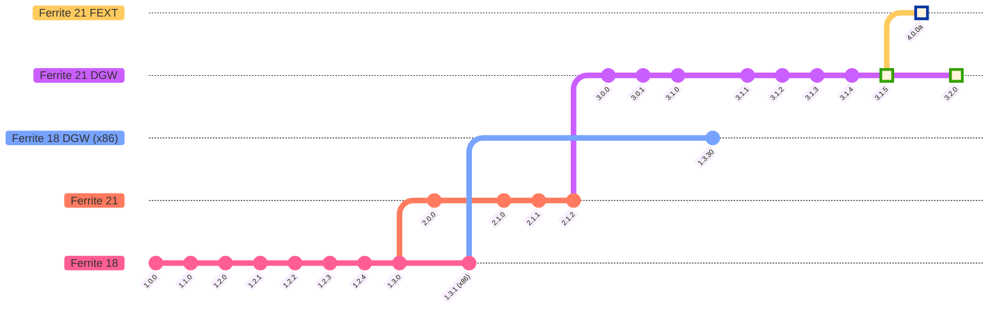

# ferrite-core

   

    <a href="README.md">English</a> | 中文

> 基于 Bitcoin Core 23.0 和新版 Litecoin Core 21.2.2 代码库的 Ferrite Core 全节点 + 钱包。 

##### 
##### 

### 📖 [通用构建指南](https://github.com/koh-gt/ferrite-core/wiki/Universal-Build-Guide)

## 💬 社区组链接
|  [Ferrite Core ](https://t.me/ferrite_core) |  [r/Ferritecoin](https://www.reddit.com/r/Ferritecoin) |  [Discord](https://discord.gg/qKgF5xhS5p) |  [X / Twitter](https://x.com/ferritecoin) |
|--|--|--|--|

## 🪙 Ferrite 供应 - 2025 年 02 月 20 日
 
&nbsp;&nbsp;&nbsp;&nbsp;&nbsp;&nbsp;&nbsp;
 
&nbsp;&nbsp;&nbsp;&nbsp;&nbsp;&nbsp;
  
&nbsp;&nbsp;
  **Activated** 
 

## 📣 公告
#### Ferrite 钱包于 2024 年 09 月 21 日在 Android 上发布
Ferrite Core v3.0.0+（2023 年 4 月后）将不受影响。它们将继续正常工作。

## 🏛️ 交易所链接
> 加密货币交易所使用户能够买卖和交易 Ferritecoin。

| 交易所 | 交易对 | 网络/桥接支持 | 上市日期 |
|--|----|---|---|
|<a href="https://xeggex.com/asset/FEC"> </a> [XeggeX] | <a href="https://xeggex.com/market/FEC_LTC" target="_blank"><b>FEC/LTC</b></a> <a href="https://xeggex.com/market/FEC_USDT" target="_blank"><b>FEC/USDT</b></a> | </a> </a> | 2023 年 03 月 18 日 |
| WIP: DEX | | | |

[XeggeX]:https://xeggex.com/asset/FEC/

| OTC | 交易对 |
|-----|---------------|
|<a href="https://discord.com/channels/859575137560297533/859831040213909554" target="_blank"> <b>Caldera</b></a>| <a href="https://discord.com/channels/1066663020257882182/1107052872736198676" target="_blank"><b>FEC OTC</b></a> | 

## 📈 市场聚合器
> 提供有关加密货币的综合信息，包括市场资本化、实时和历史价格数据、交易量、市场排名、交易所详情、图表以及关于 Ferritecoin 的基本信息。

| | 名称 | 类型 | 描述 | 上市日期 |
|-|-------|----------|-------------|--------------|
|  | [CoinPaprika] | 信息 | 价格信息和图表 | 2023 年 02 月 16 日 |
|  | [LiveCoinWatch] | 信息 | 价格信息和图表 | 2023 年 04 月 20 日 |
|  | [Coincodex] | 信息 | 价格信息和图表 | 2023 年 04 月 29 日 |
|  | [CoinCheckup] | 信息 | 价格信息和图表 | 2023 年 04 月 29 日 |
|  | [CoinMarketLeague] | 信息 | 关于 Ferritecoin 的信息、链接和投票 | 2023 年 05 月 18 日 |
|  | [Blockspot] | 信息 | 价格信息和图表 | 2023 年 10 月 18 日 |
|  | [Coinranking] | 信息 | 价格信息和图表 | 2024 年 04 月 08 日 |
|  | [Coincu] | 信息 | 价格预测 | _2024 年 06 月 29_ |
|  | [交易信息] | 信息 | 价格历史、可用的 FEC 交易对、资金贡献者 | - |

[CoinPaprika]:https://coinpaprika.com/coin/fec-ferrite  
[LiveCoinWatch]:https://www.livecoinwatch.com/price/Ferritecoin-FEC  
[Coincodex]:https://coincodex.com/crypto/ferrite/
[CoinMarketLeague]:https://coinmarketleague.com/coin/feritecoin
[CoinCheckup]:https://coincheckup.com/coins/ferrite
[Blockspot]:https://blockspot.io/coin/ferrite/
[Coinranking]:https://coinranking.com/coin/FB6AJAY69+ferritecoin-fec
[Coincu]:https://coincu.com/crypto-price-prediction/fec-ferritecoin
[交易信息]:https://github.com/koh-gt/ferrite-core/wiki/Trading-Information

## ⛏️ 挖矿信息链接
> 支持 MWEB 和不支持 MWEB 的挖矿。

| 名称 | 链接 | 描述 |
|---------------------------|-------------------------------------------------|----------------------------------------------------------------------------|
| MiningPoolStats         | [Ferrite (FEC) Scrypt](https://miningpoolstats.stream/ferrite) | Ferrite 哈希率和难度的概述。 |
| 挖矿池列表       | [Github Wiki](https://github.com/koh-gt/ferrite-core/wiki/Mining-Pools-List) | 用于挖矿 Ferrite 的 stratum 挖矿池列表。 |
| CCMiner 软件        | [版本 2.1.1](https://github.com/koh-gt/ferrite-core/releases/tag/v2.1.1) |
| 租赁 ASIC 挖矿硬件 | [Github Wiki](https://github.com/koh-gt/ferrite-core/wiki/Rent-an-ASIC-miner) |
| 快速设置指南（WIP）   | [Github Wiki](https://github.com/koh-gt/ferrite-core/wiki/Getting-Started) |

## 📦 [Wrapped Ferrite](https://github.com/koh-gt/wrapped-ferrite) 代币

适用于第三方移动钱包 - 将自定义代币 CA 添加到 Metamask 或 Trust Wallet
### 合约地址
| 代币 | 网络 | 合约地址 (CA) |
|-------|--------------------------------------------------------------------------|------------------|
|  |  [BEP-20](https://bscscan.com/token/0xA846ab3673dfb3d27F81EcFe5BcA79c06120eE6D) | `0xA846ab3673dfb3d27F81EcFe5BcA79c06120eE6D` |
|  |  | `EQCGQjLgjaSwzLezrRtKKelUwN4zpMVhNOrRjphELoAmGdoM` |
|  |  [ERC-20]() | `-----` |

### wFEC 流动性池 / DEX
|  名称 | Swap | 添加流动性 |
|----------------------------|---------------|-------------------------| 
| [][PancakeSwap BEP-20 to WFEC] [PancakeSwap][PancakeSwap BEP-20 to WFEC] | [WFEC BEP-20][PancakeSwap BEP-20 to WFEC] | [添加 v3 流动性 WFEC/USDT 窄范围 1%][PancakeSwap BEP-20 WFEC/USDT v3 1% 0.001-0.1] [添加 v2 流动性 WFEC/USDT 宽范围 0.25%][PancakeSwap BEP-20 WFEC/USDT v2 0.25% 0-inf] |
| [][Uniswap BEP-20 to WFEC] [Uniswap][Uniswap BEP-20 to WFEC] | [WFEC BEP-20][Uniswap BEP-20 to WFEC] | [添加流动性 WFEC/USDT 宽范围 0.30%][Uniswap BEP-20 WFEC/USDT 0.30% 0-inf] | 
| [STON.fi TEP-74 to WFEC]| WIP | [添加流动性 WFEC/USDT][Add liquidity WFEC/TON] |

[PancakeSwap BEP-20 to WFEC]:https://pancakeswap.finance/swap?outputCurrency=0xA846ab3673dfb3d27F81EcFe5BcA79c06120eE6D
[Uniswap BEP-20 to WFEC]:https://app.uniswap.org/#/swap?outputCurrency=0xA846ab3673dfb3d27F81EcFe5BcA79c06120eE6D

[PancakeSwap BEP-20 WFEC/USDT v3 1% 0.001-0.1]:https://pancakeswap.finance/liquidity/377069
[PancakeSwap BEP-20 WFEC/USDT v2 0.25% 0-inf]:https://pancakeswap.finance/v2/pair/0x55d398326f99059fF775485246999027B3197955/0xA846ab3673dfb3d27F81EcFe5BcA79c06120eE6D
[Uniswap BEP-20 WFEC/USDT 0.30% 0-inf]:https://app.uniswap.org/pools/55980

[Add liquidity WFEC/USDT]:https://app.ston.fi/liquidity/provide?ft=EQCGQjLgjaSwzLezrRtKKelUwN4zpMVhNOrRjphELoAmGdoM&tt=USD%E2%82%AE
[Add liquidity WFEC/TON]:https://app.ston.fi/liquidity/provide?ft=EQCGQjLgjaSwzLezrRtKKelUwN4zpMVhNOrRjphELoAmGdoM&tt=TON
[STON.fi TEP-74 to WFEC]:

## 📌 区块链信息链接
> 提供交易详情、区块信息、钱包余额、智能合约交互、网络状态和分析。它们是探索和分析区块链数据的重要工具。

| 名称 | 链接 | 描述 |
|---------------------------|-------------------------------------------------|----------------------------------------------------------------------|
| 网站                   | [查看](https://ferritecoin.org) | 包含挖矿计算器的 Ferrite 网站 |
| Ferrite 论坛             | [查看](https://ferritecoin.org:52443) | 用于讨论的 Ferrite 论坛 |
| 探索器                  | [查看](https://ferritecoin.org:53443) | 区块链浏览器，查看最新交易、流通供应和财富分布列表 |
| Ordinals 探索器         | `-----`                                   | 用于查看铭文的区块链浏览器 |
| CryptoID 探索器         | [查看](https://btc.cryptoid.info/fec/) | 具有区块挖矿历史和节点版本数据的高级浏览器 |
| 商品                   | [查看](http://shop.ferritecoin.org) | 转向 Teespring 商店，购买 Ferrite 币主题商品 |

## Ferrite 是一种加密货币，旨在实现快速且免费的支付。  

## 📝 描述
Ferritecoin (FEC) 旨在支持频繁的低成本微支付。网络费用以 FEC 的十亿分之一为单位计价，确保即使是最小的交易对用户来说仍然经济可行。Ferrite 通过整合负担得起和易于使用的特性，力求实现加密货币的民主化。

FEC 的独特功能是其链上文本消息层，允许用户直接在区块链本身上匿名通信。分布式账本系统阻止了对文本数据的审查尝试。这对于维护真正去中心化和开放的社会生态系统至关重要，在这里沟通不受外部控制或干扰。

FEC 强调隐私和安全。
它扩展了 Bitcoin 的功能，采用 MWEB 和 DGW 等高级特性，以保护用户数据和交易的安全。
- **MWEB (Mimblewimble Extension Block)** 是来自 Litecoin 的隐私协议，通过聚合、加密混淆和高效签名等技术增强了交易的机密性，使 Ferrite 交易更加私密和轻量。
- **Dark Gravity Wave (DGW)** 是来自 Dash 的难度调整算法，有助于保持稳定的区块时间和增强网络安全性，通过动态调整挖矿难度以适应近期区块生产速率。

FEC 是 Ferrite 生态系统中指定的交换货币。

## 功能：
### 不可审查的文本消息存储 -

区块链上铭刻的文本分发到每个节点并永久存储，实现防审查。
使用免费的 [Web FEXT](https://fext.ferritecoin.org) 发送不可变的私人消息。

铭文探索器在 Powershell 和 Python 上可用。
`插入 Martensite 标题图片`
Martensite 功能可用于通过 OP_RETURN 发送单字节交易 FEXT，以补充区块挖矿补贴。

### 1 分钟区块时间 -
交易即时接收，并可在几分钟内确认。

### 动态难度调整（高度超过 250,000 后） -
难度每区块调整一次，快速适应难度波动。
> 如果挖矿哈希率激增，难度将迅速上升以限制供应。
> 如果挖矿哈希率骤降，难度将迅速下降以鼓励挖矿。

### 有限的供应量 -
最多只能有 60,221,400 FEC - [查看当前供应](https://explorer.ferritecoin.org)
每个区块最多开采 100 FEC。
此数字将在每 301,107 个区块后减半，约为 8 个月（考虑区块传播时间）。

### 可负担的交易 -
费用以 FEC 的分数计价，成本微不足道。

### 透明 -
无预挖 - Linux 执行文件最早在区块 120 (2 小时) 上发布到公共 Telegram 和 Discord 群组，并于区块 3000 (50 小时) 全面迁移至 GitHub。

### 去中心化 -
Ferrite 没有所有者。矿工将决定网络的命运。

### 匿名 -
没有人知道谁拥有挖出的硬币，也不知道是谁发送了这些硬币。除非您声明自己是公共地址的所有者，否则您将保持匿名。
通过 Litecoin 的 MWEB 实现在 Ferrite 交易中实现隐私和机密性，在当今交易所强制实施严格 KYC 和 AML 措施的时代显得尤为重要。（自 2023 年 7 月 6 日起生效）

### Scrypt 算法 -
重复使用已废弃的 Litecoin、Dogecoin 和 Ethereum / Classic 挖矿设备来挖矿 Ferrite。最初设计为抗 ASIC。

## 📐 Ferrite 币规格
### 技术规格：  
### 开始日期: 2022 年 11 月 22 日

算法类型: Scrypt, 工作量证明 (PoW)  
端口: 9573（RPC）, 9574（P2P）  
区块时间: 1 分钟  
难度调整时间: 1 区块或 1 小时  
减半间隔: 301,107 个区块  
传播时间: 5 秒 (8.3% 脱节率)  
区块大小: 3.8147 MiB  
交易容量: 105/s  
预挖: 无预挖  

### 经济规格：  

初始区块奖励: 𝔽 100  
最大供应量: 𝔽 60,221,400  
有奖励的区块数: 10,237,637 个区块（33 次减半 -1）  
减半间隔时间: 最少 209 天  
奖励寿命: 最少 7109 天 (19.48 年)  

### Coinhana（进行中）

 
## ℹ️ 额外信息 - 

### 为什么叫 Ferrite Core？
普通的铁氧体磁芯便宜且不显眼。大多数人从未听说过它，但它使我们的发电机、开关和天线得以正常工作。它具有高磁导率，允许磁场通过，但电导率低，减少了涡流损耗。最重要的是，铁氧体磁芯在保持这些特性的同时便宜且安全，这使其适合用作电磁线圈的磁性芯。

比特币被称为数字黄金，Litecoin 被称为数字银。Ferrite 是 Ferrite。
> 在现实世界中，我们使用以铁磁基金属制成的硬币，因为黄金和白银过于珍贵而无法用于流通。[阿里斯托芬](https://github.com/koh-gt/ferrite-core/wiki/About-Ferrite-Core#transaction-reports)

低廉的价格将为大众采用扫清障碍。
类似地，我希望 Ferrite Core 能被用于快速、低量的交易以及发展中国家无银行账户人群避免高昂汇款成本的小额汇款。
低廉的价格将确保 Ferrite 硬币及其费用保持负担得起。
Ferrite 币的标志是 IEEE-315 电路图符号中的铁氧体磁珠。

市场上有如此多的硬币，什么让它特别？ - 
截至 2024 年，我们已引入/计划在 Ferritecoin 中添加多个新功能，包括来自 Litecoin 的 MWEB 和来自 Dash 的 [DGWv3](https://github.com/koh-gt/ferrite-core/wiki/About-Ferrite-Core#difficulty-algorithm-hardfork)。FEXT 是一个用于发送和查看区块链上 OP_RETURN 铭文的实验性脚本。目前仅支持文本。
在一个充斥着模因币和其他带有开发者和营销费用/储备金的硬币的时代，Ferritecoin 没有预挖。
100% 的供应量可通过挖矿获得，每个区块最初产生 100 枚硬币，并在每 301,107 个区块后减半。 
每个钱包或“账户”都是平等的。没有特殊或管理/开发者地址。

高采用率不必昂贵，高市值不是实现高采用的方法。
有多少人是出于技术特性而非利润潜力而参与加密货币的？

### 图表
这种硬币要么在未来一两年内非常活跃，要么完全不活跃，假设区块时间保持不变。为了实际性，图表不会扩展到 750 天范围之外。这应该足以捕捉前三个减半周期。

每个减半纪元的总代币供应量可以通过以下公式计算：

$$\sum_{i=0}^{33}301,107\left(\frac{100}{2^i}\right)\approx60,221,400$$

