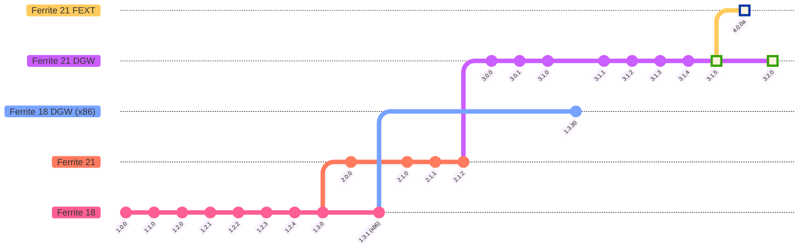

# ⚙️ Ferrite Core

### *基于 Bitcoin Core 23.0 与最新 Litecoin Core 21.2.2 代码库构建的 Ferrite Core 全节点 + 钱包。*

**🌐 语言：** [🇬🇧 English](README.md) | **🇨🇳 中文** | [🇪🇸 Español](README-es.md) | [🇮🇳 हिंदी](README-hi.md)

---

## 🔴 实时网络数据

---

## 💬 加入社区

|  |  |  |  |
|:---:|:---:|:---:|:---:|
| [**Telegram**](https://t.me/ferrite_core) | [**r/Ferritecoin**](https://www.reddit.com/r/Ferritecoin) | [**Discord**](https://discord.gg/qKgF5xhS5p) | [**X / Twitter**](https://x.com/ferritecoin) |

---

## 📌 重要链接

> 探索钱包、水龙头与区块浏览器，与 Ferrite 网络交互。

| 🔗 资源 | 链接 | 描述 |
|---|---|---|
| 🌐 **官方网站** | [ferritecoin.org](https://ferritecoin.org) | Ferritecoin 官方主页 |
| 💳 **FEC 网页钱包** | [标准版](https://ferritecoin.org/wallet) · [高级版](https://ferritecoin.org/wallet_advanced) | Ferritecoin 原生浏览器钱包 |
| 🪙 **多币种钱包** | [打开](https://ferritecoin.org/multiwallet) | 多币种钱包——兼容比特币与莱特币 |
| 🚰 **水龙头** | [领取 FEC](https://ferritecoin.org/faucet) | 免费领取 Ferritecoin 开始体验 |
| 🔍 **区块浏览器** | [explorer.ferritecoin.org](https://explorer.ferritecoin.org) | 实时交易、供应量与富豪榜 |
| 💬 **FEXT 信使** | [打开](https://ferritecoin.org/fext) | 链上消息发送界面 |
| 🛍️ **周边商店** | [购物](http://shop.ferritecoin.org) | 官方 Ferritecoin 主题周边商店 |

---

## 🚀 版本发布

---

## 📱 移动端钱包

> **Ferrite 安卓钱包** — 发布于 **2024年9月21日**

---

## 📣 公告

> ⚠️ **Ferrite Core v3.0.0 及以上版本**（2023年4月起）**不受**网络变更影响，将继续正常运行。

---

## 🏛️ 交易所

> 在以下平台交易 Ferritecoin。购买、出售并在支持的网络间转移 FEC。

| 交易所 | 交易对 | 支持网络 | 上线日期 |
|---|---|---|---|
|  **[AnonEx](https://anonex.io/asset/FEC)** |  [**FEC/LTC**](https://anonex.io/market/FEC_LTC) ·  [**FEC/USDT**](https://anonex.io/market/FEC_USDT) |   | 2026-02-19 |
| 🔨 **Coinhana-FE** | *即将推出* | — | — |

### 🤝 场外交易（OTC）

| 平台 | 交易对 |
|---|---|
| <a href="https://discord.com/channels/859575137560297533/859831040213909554"> **Caldera**</a> | <a href="https://discord.com/channels/1066663020257882182/1107052872736198676"> **FEC OTC**</a> |

---

## 📈 行情聚合平台

> Ferritecoin 的实时价格数据、图表、排名与市场信息。

| | 平台 | 类型 | 描述 | 上线日期 |
|---|---|---|---|---|
|  | [**CoinPaprika**](https://coinpaprika.com/coin/fec-ferrite) | 信息 | 价格与图表 | 2023-02-16 |
|  | [**LiveCoinWatch**](https://www.livecoinwatch.com/price/Ferritecoin-FEC) | 信息 | 价格与图表 | 2023-04-20 |
|  | [**CoinCodex**](https://coincodex.com/crypto/ferrite/) | 信息 | 价格与图表 | 2023-04-29 |
|  | [**CoinCheckup**](https://coincheckup.com/coins/ferrite) | 信息 | 价格与图表 | 2023-04-29 |
|  | [**CoinMarketLeague**](https://coinmarketleague.com/coin/feritecoin) | 信息 | 概览、链接与投票 | 2023-05-18 |
|  | [**Blockspot**](https://blockspot.io/coin/ferrite/) | 信息 | 价格与图表 | 2023-10-18 |
|  | [**Coinranking**](https://coinranking.com/coin/FB6AJAY69+ferritecoin-fec) | 信息 | 价格与图表 | 2024-04-08 |
|  | [**Coincu**](https://coincu.com/crypto-price-prediction/fec-ferritecoin) | 信息 | 价格预测 | 2024-06-29 |
| | [**交易信息**](https://github.com/koh-gt/ferrite-core/wiki/Trading-Information) | Wiki | 价格历史、交易对及贡献者 | — |

---

## ⛏️ 挖矿

> Ferrite 支持完整 MWEB，可使用基于 Scrypt 算法的硬件进行挖矿。

| 资源 | 链接 | 描述 |
|---|---|---|
| 📊 **MiningPoolStats** | [Ferrite (FEC) Scrypt](https://miningpoolstats.stream/ferrite) | 实时算力与难度概览 |
| 🏊 **矿池列表** | [GitHub Wiki](https://github.com/koh-gt/ferrite-core/wiki/Mining-Pools-List) | Stratum 矿池目录 |
| 🖥️ **CCMiner 软件** | [v2.1.1 版本](https://github.com/koh-gt/ferrite-core/releases/tag/v2.1.1) | GPU 挖矿软件 |
| 🤖 **租用 ASIC 矿机** | [GitHub Wiki](https://github.com/koh-gt/ferrite-core/wiki/Rent-an-ASIC-miner) | ASIC 矿机租用指南 |
| 🚀 **快速入门指南** | [GitHub Wiki](https://github.com/koh-gt/ferrite-core/wiki/Getting-Started) | 新手挖矿配置教程 |

---

## 📦 封装 Ferrite（wFEC）

> 将 Ferrite 引入 EVM 兼容网络。在 **MetaMask** 或 **Trust Wallet** 中将 wFEC 添加为自定义代币。

### 🔗 合约地址

| 代币 | 网络 | 合约地址 |
|---|---|---|
|  |  **[BEP-20](https://bscscan.com/token/0xA846ab3673dfb3d27F81EcFe5BcA79c06120eE6D)** | `0xA846ab3673dfb3d27F81EcFe5BcA79c06120eE6D` |
| wFEC TON | **TON** | `EQCGQjLgjaSwzLezrRtKKelUwN4zpMVhNOrRjphELoAmGdoM` |
|  |  **ERC-20** | `即将推出` |

### 💧 流动性池与去中心化交易所

| DEX | 兑换 | 添加流动性 |
|---|---|---|
|  **PancakeSwap** | [兑换 WFEC (BEP-20)](https://pancakeswap.finance/swap?outputCurrency=0xA846ab3673dfb3d27F81EcFe5BcA79c06120eE6D) | [v3 WFEC/USDT — 1% 窄区间](https://pancakeswap.finance/liquidity/377069) · [v2 WFEC/USDT — 0.25% 宽区间](https://pancakeswap.finance/v2/pair/0x55d398326f99059fF775485246999027B3197955/0xA846ab3673dfb3d27F81EcFe5BcA79c06120eE6D) |
|  **Uniswap** | [兑换 WFEC (BEP-20)](https://app.uniswap.org/#/swap?outputCurrency=0xA846ab3673dfb3d27F81EcFe5BcA79c06120eE6D) | [WFEC/USDT — 0.30% 宽区间](https://app.uniswap.org/pools/55980) |
| **STON.fi** | *即将推出* | [WFEC/USDT](https://app.ston.fi/liquidity/provide?ft=EQCGQjLgjaSwzLezrRtKKelUwN4zpMVhNOrRjphELoAmGdoM&tt=USD%E2%82%AE) · [WFEC/TON](https://app.ston.fi/liquidity/provide?ft=EQCGQjLgjaSwzLezrRtKKelUwN4zpMVhNOrRjphELoAmGdoM&tt=TON) |

---

## 🗺️ 版本路线图

---

## ⚡ 快速。免费。Ferrite。

---

## 📝 什么是 Ferritecoin？

**Ferritecoin（FEC）** 为现实世界而生。它专为频繁、低成本的小额交易而设计，每一分钱的零头都至关重要。网络手续费以 FEC 的亿分之一（1/100,000,000）为单位计价，确保即便是最小额的转账，对任何人在任何地方都具有经济可行性。

Ferrite 的使命很简单：通过低成本、高速度与开放性，**让所有人都能平等地使用加密货币**。

### 🔒 隐私与安全

Ferrite 在比特币基础上引入了经过实战检验的强大隐私技术：

- **MWEB（Mimblewimble 扩展区块）** 借鉴自莱特币，通过聚合、密码学混淆与轻量级签名增强交易保密性。交易变得私密、紧凑且不可追踪。

- **暗重力波（DGW）** 改编自 Dash，是一种动态难度调整算法，即使在算力剧烈波动的情况下也能维持稳定的 1 分钟出块时间，保护网络免受操控。

### 🗣️ 无法审查的链上消息

Ferrite 内置独特的**链上文字消息层（FEXT）**，允许用户直接在区块链上匿名、永久地发送无法被审查的消息。由于消息会分发至每个节点并永久存储，任何机构都无法将其删除。

> FEC 是整个 Ferrite 生态系统的原生交换货币。

---

## ✨ 核心功能亮点

### 💬 抗审查文字消息

刻入区块链的文字将永久分发至每个节点。不可篡改、无国界、完全免费。

使用 [**Web FEXT**](https://ferritecoin.org/fext) 信使即时发送私密链上消息。

> 🛠️ 铭文浏览器可通过 **PowerShell** 与 **Python** 使用。
>
> **马氏体（Martensite）** 是一项即将推出的功能，可实现单字节 OP_RETURN FEXT 交易，以在区块补贴之上补充矿工手续费收入。

---

### ⏱️ 1 分钟出块时间
交易即时传播，数分钟内确认。

### 🌊 动态难度调整 *（第 250,000 区块后激活）*
难度**每个区块**重新校准，实时响应算力变化：
- 📈 算力飙升？难度迅速上升以保护供应量。
- 📉 算力下降？难度迅速下降以保持挖矿可及性。

### 🔢 严格限定总供应量
**𝔽 60,221,400** FEC，永不增发。

- 初始区块奖励：**𝔽 100**
- 减半间隔：每 **301,107 个区块**（约 8 个月）
- 共计 33 次减半

[**→ 查看当前流通供应量**](https://explorer.ferritecoin.org)

### 💸 近乎零的交易手续费
手续费以 FEC 的极小零头计价，无论转账金额多小，每一笔转账都具有经济意义。

### 🌍 完全透明
**无预挖。** Linux 可执行文件早在**第 120 个区块**（启动约 2 小时后）便已上传至公开的 Telegram 与 Discord，并于**第 3,000 个区块**（约 50 小时后）完整迁移至 GitHub。

### 🏛️ 真正去中心化
Ferrite 没有所有者。**矿工共同治理网络。** 仅此而已。

### 🎭 默认假名性
无需身份验证。除非**您**主动披露，否则没有人知道谁拥有或转移了这些币。

自**第 150,000 区块（2023年7月6日）**起激活 **MWEB**，交易可实现完全保密——在 KYC/AML 监管日益严格的今天，这一点至关重要。

### ⚙️ Scrypt 算法 | 兼容 ASIC 与 GPU
将闲置的**莱特币、狗狗币或以太坊经典**挖矿硬件重新利用。最初以抗 ASIC 为设计目标，现已兼容现代 Scrypt ASIC，实现最大程度的可及性。

---

## 📐 技术规格

### ⚙️ 协议参数

| 参数 | 值 |
|---|---|
| **启动日期** | 2022年11月22日 |
| **算法** | Scrypt，工作量证明 |
| **RPC 端口** | 9573 |
| **P2P 端口** | 9574 |
| **出块时间** | 1 分钟 |
| **难度调整** | 每个区块（DGW） |
| **减半间隔** | 301,107 个区块 |
| **传播时间** | ~5 秒（8.3% 孤块率） |
| **区块大小** | 3.8147 MiB |
| **交易吞吐量** | ~105 笔/秒 |
| **预挖** | ❌ 无 |

### 💰 经济模型

| 参数 | 值 |
|---|---|
| **初始区块奖励** | 𝔽 100 |
| **最大供应量** | 𝔽 60,221,400 |
| **有奖励的区块数** | 10,237,637（33 次减半） |
| **最短减半周期** | ~209 天 |
| **总奖励年限** | ~7,109 天（19.48 年） |

所有减半周期的总供应量由以下公式定义：

$$\sum_{i=0}^{33} 301{,}107 \left(\frac{100}{2^i}\right) \approx 60{,}221{,}400$$

---

## 🔨 Coinhana *（开发中）*

---

## ℹ️ 为何命名为"Ferrite Core"？

**铁氧体磁芯（ferrite core）** 是电子学中最不受重视的元器件之一。价格低廉、隐藏于设备内部，鲜少被人提及。然而没有它，发电机、无线电天线与电源开关便无法正常工作。其秘诀在于一种优雅的组合：**高磁导率**（让磁场自由通过）与**低电导率**（消除涡流损耗）的完美结合。这一切以极低成本实现，且无任何安全隐患。

> *比特币是数字黄金，莱特币是数字白银，Ferrite 就是铁氧体。*
>
> 现实世界中，我们使用铁基金属铸造的硬币，因为黄金与白银太过珍贵，不适合日常流通 —— [阿里斯托芬](https://github.com/koh-gt/ferrite-core/wiki/About-Ferrite-Core#transaction-reports)

Ferritecoin 的目标是成为**日常数字货币**。它被设计为快速、低成本且易于使用，尤其适合发展中国家那些没有银行账户、却面临高额汇款费用的人群。

> 🔷 Ferrite 硬币图标源自 **IEEE-315 铁氧体磁珠的电路符号**。

### 2024 年，Ferritecoin 有何独特之处？

- ✅ **MWEB** 隐私协议 | 借鉴自莱特币
- ✅ **DGWv3** 难度算法 | 改编自 Dash
- ✅ **FEXT** 实验性链上 OP_RETURN 消息
- ✅ **零预挖** | 100% 供应量通过公平挖矿产生
- ✅ **无开发者费用、无营销储备、无特殊地址**
- ✅ 每个钱包地位平等。每一枚挖出的币直接归属于矿工。

---

*Ferritecoin*

**[🌐 ferritecoin.org](https://ferritecoin.org)**

