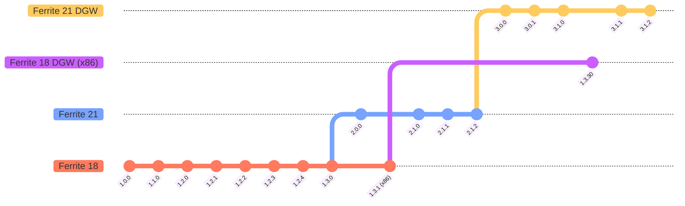

# ferrite-core
### 

### Announcement
#### If you have installed Ferrite Core before Apr 2023, please update to v3+ by height $250,000$ (mid 2024).**  

> Ferrite Core full node + wallet based on Bitcoin Core 23.0 and new Litecoin Core 21.2 codebase. 

### 

## Community group links
|  [Ferrite Core ](https://t.me/ferrite_core) |  [r/Ferritecoin](https://www.reddit.com/r/Ferritecoin) |  [Discord](https://discord.gg/qKgF5xhS5p) |  [Twitter](https://twitter.com/ferritecoin) |
|--|--|--|--|

## Ferrite supply - 2023 10 14
 
&nbsp;&nbsp;&nbsp;&nbsp;&nbsp;&nbsp;&nbsp;
 
&nbsp;&nbsp;&nbsp;&nbsp;&nbsp;&nbsp;
 

## Mining information links
> Mineable with or without MWEB support.

| Name                      | Link                                            | Description                                                                |
|---------------------------|-------------------------------------------------|----------------------------------------------------------------------------|
| MiningPoolStats         | [Ferrite (FEC) Scrypt](https://miningpoolstats.stream/ferrite) | Overview of Ferrite hashrate and difficulty. |
| Mining pools list       | [Github Wiki](https://github.com/koh-gt/ferrite-core/wiki/Mining-Pools-List) | A list of stratum mining pools to mine Ferrite. |
| CCMiner software        | [Release 2.1.1](https://github.com/koh-gt/ferrite-core/releases/tag/v2.1.1) |
| Rent ASIC mining hardware | [Github Wiki](https://github.com/koh-gt/ferrite-core/wiki/Rent-an-ASIC-miner) |
| Quick setup guide (WIP)   | [Github Wiki](https://github.com/koh-gt/ferrite-core/wiki/Getting-Started) |

## Trading information links
| | Name                      | Type     | Description                                                                |
|-|---------------------------|----------|----------------------------------------------------------------------------| 
|  | [CoinPaprika](https://coinpaprika.com/coin/fec-ferrite/) | Info | Price information and charts |
|  | [LiveCoinWatch](https://www.livecoinwatch.com/price/Ferritecoin-FEC) | Info | Price information and charts | 
|  | [Coincodex](https://coincodex.com/crypto/ferrite/) | Info | Price information and charts |
|  | [CoinMarketLeague](https://coinmarketleague.com/coin/feritecoin) | Info | Price information and charts |
|  | [CoinCheckup](https://coincheckup.com/coins/ferrite) | Info | Price information and charts |
|  | [Blockspot](https://blockspot.io/coin/ferrite/) | Info | Price information and charts |
|  | [Trading Information](https://github.com/koh-gt/ferrite-core/wiki/Trading-Information) | Info | Price history, available FEC trading pairs, funding contributors |

## Exchange links
| Exchange | Trading pairs |
|--|----|
| <a href="https://xeggex.com/asset/FEC" target="_blank"> <b>XeggeX</b></a> | <a href="https://xeggex.com/market/FEC_LTC" target="_blank"><b>FEC/LTC</b></a> <a href="https://xeggex.com/market/FEC_USDT" target="_blank"><b>FEC/USDT</b></a>|
|<a href="https://nonkyc.io/asset/FEC" target="_blank"> <b>NonKYC</b></a>| <a href="https://nonkyc.io/market/FEC_BTC" target="_blank"><b>FEC/BTC</b></a> <a href="https://nonkyc.io/market/FEC_XMR" target="_blank"><b>FEC/XMR</b></a> <a href="https://nonkyc.io/market/FEC_LTC" target="_blank"><b>FEC/LTC</b></a> <a href="https://nonkyc.io/market/FEC_USDT" target="_blank"><b>FEC/USDT</b></a>|

| OTC | Trading pairs |
|-----|---------------|
|<a href="https://discord.com/channels/859575137560297533/859831040213909554" target="_blank"> <b>Caldera</b></a>| <a href="https://discord.com/channels/1066663020257882182/1107052872736198676" target="_blank"><b>FEC OTC</b></a> | 

## [Wrapped Ferrite](https://github.com/koh-gt/wrapped-ferrite) Token
For third party movile wallets - add custom token CA to Metamask or Trust Wallet
### Contract addresses
| Token | Network | Contract address (CA) |
|-------|--------------------------------------------------------------------------|------------------|
|  |  [BEP-20](https://bscscan.com/token/0xA846ab3673dfb3d27F81EcFe5BcA79c06120eE6D) | `0xA846ab3673dfb3d27F81EcFe5BcA79c06120eE6D` |
|  |  [ARB-20](https://arbiscan.io/token/0x09bf659db25522bc9c367163966f35ac268e5b75) | `0x09bf659Db25522bc9c367163966f35ac268e5b75` |
|  |  [ERC-20]() | `---` |

### Mainnet FEC <-> Tokenised wFEC 
| | Name                      | Type     | Description                                                                |
|-|---------------------------|----------|----------------------------------------------------------------------------| 
| 

 | [XeggeX](https://xeggex.com/asset/FEC) | Exchange | [FEC/USDT](https://xeggex.com/market/FEC_USDT) [FEC/LTC](https://xeggex.com/market/FEC_LTC) | 

### wFEC liquidity pools / DEX
| | Name                      | Type     | Description                                                                |
|-|---------------------------|----------|----------------------------------------------------------------------------| 
| 

 | [PancakeSwap](https://pancakeswap.finance/swap?outputCurrency=0xA846ab3673dfb3d27F81EcFe5BcA79c06120eE6D) | DEX | [BEP-20](https://pancakeswap.finance/swap?outputCurrency=0xA846ab3673dfb3d27F81EcFe5BcA79c06120eE6D) |
| 

 | [Uniswap](https://app.uniswap.org/#/swap?outputCurrency=0x09bf659Db25522bc9c367163966f35ac268e5b75) | DEX | [ARB-20](https://app.uniswap.org/#/swap?outputCurrency=0x09bf659Db25522bc9c367163966f35ac268e5b75) | 

## Blockchain information links
| Name                      | Link                                            | Description                                                          |
|---------------------------|-------------------------------------------------|----------------------------------------------------------------------|
| Website                   | [View](https://ferritecoin.org) | Ferrite website with mining calculator |
| Explorer                  | [View](http://explorer.ferritecoin.org) | Blockchain explorer to view latest transactions, circulating supply and rich list distribution |
| CryptoID Explorer         | [View](https://btc.cryptoid.info/fec/) | An advanced explorer with block mining history and node version data |
| Merchandise               | [View](http://shop.ferritecoin.org) | Redirect link to Teespring shop with Ferrite coin themed merchandise |

## Ferrite is a cryptocurrency that seeks to enable fast and free payments.   

### Description
Ferritecoin (FEC) is designed for frequent low-cost microtransactions. Network fees are denominated in 1/100,000,000 atomic subdivisions of FEC, ensuring that even the smallest transactions remain economically viable for users. Ferrite seeks to democratise access to cryptocurrency by integrating affordability and ease of use.

A unique feature of FEC is its inclusion of an on-chain text messaging layer where users can communicate anonymously directly on the blockchain itself. The distributed ledger system prevents any attempts at censorship of text data. This is crucial for maintaining a truly decentralized and open social ecosystem, where communication is free from external control or interference.

FEC places a strong emphasis on privacy and security. 
It expands on Bitcoin to employ advanced features such as MWEB and DGW to safeguard user data and transactions. 
- MWEB (Mimblewimble Extension Block) is a privacy protocol from Litecoin that enhances transaction confidentiality by using techniques like aggregation, cryptographic obfuscation, and efficient signatures to make Ferrite transactions more private and lightweight. 
- Dark Gravity Wave (DGW) is a difficulty adjustment algorithm from Dash that helps maintain stable block times and enhances network security by dynamically adjusting mining difficulty based on recent block production rates.

FEC is the designated exchange currency within the Ferrite ecosystem.

## Features:
### Uncensorable text messaging storage -
Text inscribed on the blockchain are distributed to every node and stored permanently, allowing for censorship proofing.
Use [Ferritext](https://github.com/koh-gt/ferritext) OP_RETURN tool to send messages.
Inscription explorer will be launched soon.

### 1 minute block time - 
Transactions are received instantly and can be confirmed within minutes.

### Dynamic difficulty adjustment (after height 250,000) - 
Difficulty adjusts every block, adapting quickly to difficulty fluctuations.
> If mining hashrate spikes, difficulty will quickly rise to limit supply.
> If mining hashrate plummets, difficulty will quickly drop to encourage mining.

### Limited supply - 
There will be no more than 60,221,400 FEC - [View current supply](https://explorer.ferritecoin.org)
A maximum of $100$ FEC (Ferrite coins) are mined in a block. 
This number will halve every $301107$ blocks, or about 8 months considering block propagation time.

### Affordable transactions -
Fees are denominated in fractions of Ferrite, which amounts to a negligible cost.

### Transparent - 
No pre-mine - Linux Executables are uploaded on public Telegram and Discord groups as early as block 120 (2 hours), with full migration to Github by block 3000 (50 hours).

### Decentralised - 
Ferrite has no owner. The miners shall decide the fate of the network.

### Pseudonymous -
Nobody knows who owns the mined coins, nor who sent the coins. Unless you identify as the owner of the public address, you maintain anonymity.
With Litecoin's MWEB implementation on Ferrite transactions can be made private and confidential at a time where exchanges are mandating strict KYC and AML measures. (active as of height 150,000 on 6 Jul 2023)

### Scrypt Algorithm -  
Reuse obsolete Litecoin, Dogecoin and Ethereum / Classic miners to mine Ferrite. Originally designed to be ASIC resistant. 

## Ferrite coin specifications
### Technical specifications:  
### Start Date: 22 Nov 2022

Algorithm type: Scrypt, Proof of Work  
Ports: 9573 (RPC), 9574 (P2P)  
Block time: 1 minute  
Difficulty adjustment time: 1 block or 1 hour  
Halving time: 301,107 blocks  
Propogation time: 5 seconds (8.3% detached rate)  
Block size: 3.8147 MiB  
Transaction capacity: 105/s  
Premine: No premine  

### Economic specifications:  

Initial block reward: 𝔽 100  
Maximum supply: 𝔽 60,221,400  
Blocks with reward: 10,237,637 blocks (33 halvings -1)  
Halving timespan: at minimum 209 days  
Reward lifespan: at minimum 7109 days (19.48 years)  
 
## Additional information - 

### Why the name Ferrite Core?
The humble ferrite core is cheap and hidden from view. Most people have never heard about it, yet it is what allows our electric generators, switches and radio antennas to function. It has high magnetic permeability allowing for magnetic fields to pass through, yet has low electrical conductivity which reduces eddy current losses. Most importantly, the ferrite core possesses these properties while being cheap and safe to use. This makes the ferrite core suitable for being used as magnetic cores for electromagnet coils. 

Bitcoin is considered as digital gold, Litecoin as digital silver. Ferrite is ferrite. 
> In the real world, we use coins made of ferrous base metals because gold and silver are too precious for circulation. 

A cheap and low barrier to entry will allow for mass adoption.
Similarly, I hope that Ferrite Core will be used for fast, low volume transactions as well as small amount remittances for the unbanked people in developing nations to avoid exuberant remittance costs. 
A low price will ensure that Ferrite coins and its fees stay affordable.  
The Ferrite coin logo is the IEEE-315 circuit diagram symbol for a ferrite bead.

There are so many coins out there, what makes this special? - Nothing for now. This coin is created as a non-profit experimental software. Ferrite Core is just copied code, pre-generated code, and lines of edited code from multiple sources. Ferrite coins, like other cryptocurrencies, have zero intrinsic value. Do not invest more than what you can afford to lose.

High adoption rates need not be expensive, and high market cap is not the way to having high adoption.
How many people are in cryptocurrency for its technological features rather than its profit potential?

### Graphs
This coin would either be very active or completely inactive in a year or two. For the sake of practicality the graphs will not extend beyond the time scope of 750 days. This should be enough to capture the first 3 halvings.  

The total coin supply per halving epoch can be found using this equation.

$$\sum_{i=0}^{33}301,107\left(\frac{100}{2^i}\right)\approx60,221,400$$

