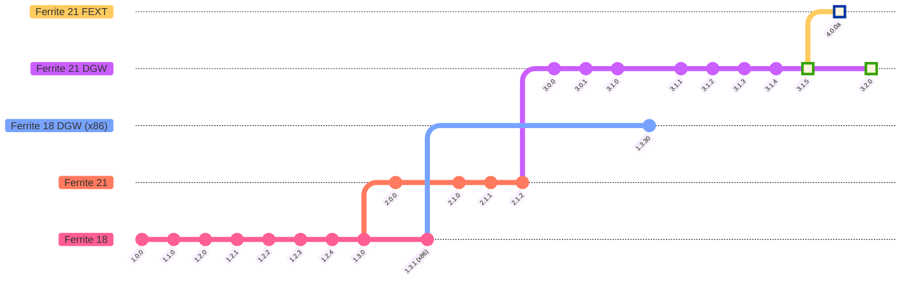

# ⚙️ Ferrite Core

### *Ferrite Core full node + wallet based on Bitcoin Core 23.0 and new Litecoin Core 21.2.2 codebase.*

**🌐 Language:** 🇬🇧 English | **[🇨🇳 中文](README-zh.md)** | [🇪🇸 Español](README-es.md) | [🇮🇳 हिंदी](README-hi.md)

---

## 🔴 Live Network Statistics

---

## 💬 Join the Community

|  |  |  |  |
|:---:|:---:|:---:|:---:|
| [**Telegram**](https://t.me/ferrite_core) | [**r/Ferritecoin**](https://www.reddit.com/r/Ferritecoin) | [**Discord**](https://discord.gg/qKgF5xhS5p) | [**X / Twitter**](https://x.com/ferritecoin) |

---

## 📌 Essential Links

> Explore wallets, faucets, block explorers. Interact with the Ferrite network.

| 🔗 Resource | Link | Description |
|---|---|---|
| 🌐 **Website** | [ferritecoin.org](https://ferritecoin.org) | Official Ferritecoin homepage |
| 💳 **FEC Web Wallet** | [Main](https://ferritecoin.org/wallet) · [Advanced](https://ferritecoin.org/wallet_advanced) | Ferritecoin-native browser wallet |
| 🪙 **Multiwallet** | [Open](https://ferritecoin.org/multiwallet) | Multi-coin wallet — compatible with Bitcoin & Litecoin |
| 🚰 **Faucet** | [Claim FEC](https://ferritecoin.org/faucet) | Receive free Ferritecoins to get started |
| 🔍 **Block Explorer** | [explorer.ferritecoin.org](https://explorer.ferritecoin.org) | Real-time transactions, supply & rich list |
| 💬 **FEXT Messenger** | [Open](https://ferritecoin.org/fext) | On-chain messaging interface |
| 🛍️ **Merchandise** | [Shop](http://shop.ferritecoin.org) | Official Ferritecoin-themed merch store |

---

## 🚀 Releases

---

## 📱 Mobile Wallet

> **Ferrite Wallet for Android** - Released **21 September 2024**

---

## 📣 Announcements

> ⚠️ **Ferrite Core v3.0.0+** (April 2023 onwards) is **unaffected** by network changes and will continue to operate normally.

---

## 🏛️ Exchanges

> Trade Ferritecoin on the following platforms. Buy, sell, and move FEC across supported networks.

| Exchange | Trading Pairs | Network Support | Listed |
|---|---|---|---|
|  **[AnonEx](https://anonex.io/asset/FEC)** |  [**FEC/LTC**](https://anonex.io/market/FEC_LTC) ·  [**FEC/USDT**](https://anonex.io/market/FEC_USDT) |   | 2026-02-19 |
| 🔨 **Coinhana-FE** | *Coming Soon* | — | — |

### 🤝 OTC Trading

| Platform | Pair |
|---|---|
| <a href="https://discord.com/channels/859575137560297533/859831040213909554"> **Caldera**</a> | <a href="https://discord.com/channels/1066663020257882182/1107052872736198676"> **FEC OTC**</a> |

---

## 📈 Market Aggregators

> Real-time price data, charts, rankings, and market intelligence for Ferritecoin.

| | Platform | Type | Description | Listed |
|---|---|---|---|---|
|  | [**CoinPaprika**](https://coinpaprika.com/coin/fec-ferrite) | Info | Price & charts | 2023-02-16 |
|  | [**LiveCoinWatch**](https://www.livecoinwatch.com/price/Ferritecoin-FEC) | Info | Price & charts | 2023-04-20 |
|  | [**CoinCodex**](https://coincodex.com/crypto/ferrite/) | Info | Price & charts | 2023-04-29 |
|  | [**CoinCheckup**](https://coincheckup.com/coins/ferrite) | Info | Price & charts | 2023-04-29 |
|  | [**CoinMarketLeague**](https://coinmarketleague.com/coin/feritecoin) | Info | Overview, links & voting | 2023-05-18 |
|  | [**Blockspot**](https://blockspot.io/coin/ferrite/) | Info | Price & charts | 2023-10-18 |
|  | [**Coinranking**](https://coinranking.com/coin/FB6AJAY69+ferritecoin-fec) | Info | Price & charts | 2024-04-08 |
|  | [**Coincu**](https://coincu.com/crypto-price-prediction/fec-ferritecoin) | Info | Price prediction | 2024-06-29 |
| | [**Trading Information**](https://github.com/koh-gt/ferrite-core/wiki/Trading-Information) | Wiki | Price history, trading pairs & contributors | — |

---

## ⛏️ Mining

> Ferrite is mineable with full MWEB support using Scrypt-based hardware.

| Resource | Link | Description |
|---|---|---|
| 📊 **MiningPoolStats** | [Ferrite (FEC) Scrypt](https://miningpoolstats.stream/ferrite) | Live hashrate & difficulty overview |
| 🏊 **Mining Pools List** | [GitHub Wiki](https://github.com/koh-gt/ferrite-core/wiki/Mining-Pools-List) | Stratum pool directory |
| 🖥️ **CCMiner Software** | [Release v2.1.1](https://github.com/koh-gt/ferrite-core/releases/tag/v2.1.1) | GPU mining software |
| 🤖 **Rent ASIC Hardware** | [GitHub Wiki](https://github.com/koh-gt/ferrite-core/wiki/Rent-an-ASIC-miner) | Guide to renting ASIC miners |
| 🚀 **Quick Start Guide** | [GitHub Wiki](https://github.com/koh-gt/ferrite-core/wiki/Getting-Started) | Beginner's mining setup guide |

---

## 📦 Wrapped Ferrite (wFEC)

> Bring Ferrite to EVM-compatible networks. Add wFEC as a custom token in **MetaMask** or **Trust Wallet**.

### 🔗 Contract Addresses

| Token | Network | Contract Address |
|---|---|---|
|  |  **[BEP-20](https://bscscan.com/token/0xA846ab3673dfb3d27F81EcFe5BcA79c06120eE6D)** | `0xA846ab3673dfb3d27F81EcFe5BcA79c06120eE6D` |
| wFEC TON | **TON** | `EQCGQjLgjaSwzLezrRtKKelUwN4zpMVhNOrRjphELoAmGdoM` |
|  |  **ERC-20** | `Coming Soon` |

### 💧 Liquidity Pools & DEX

| DEX | Swap | Add Liquidity |
|---|---|---|
|  **PancakeSwap** | [Swap WFEC (BEP-20)](https://pancakeswap.finance/swap?outputCurrency=0xA846ab3673dfb3d27F81EcFe5BcA79c06120eE6D) | [v3 WFEC/USDT — 1% Narrow](https://pancakeswap.finance/liquidity/377069) · [v2 WFEC/USDT — 0.25% Wide](https://pancakeswap.finance/v2/pair/0x55d398326f99059fF775485246999027B3197955/0xA846ab3673dfb3d27F81EcFe5BcA79c06120eE6D) |
|  **Uniswap** | [Swap WFEC (BEP-20)](https://app.uniswap.org/#/swap?outputCurrency=0xA846ab3673dfb3d27F81EcFe5BcA79c06120eE6D) | [WFEC/USDT — 0.30% Wide](https://app.uniswap.org/pools/55980) |
| **STON.fi** | *Coming Soon* | [WFEC/USDT](https://app.ston.fi/liquidity/provide?ft=EQCGQjLgjaSwzLezrRtKKelUwN4zpMVhNOrRjphELoAmGdoM&tt=USD%E2%82%AE) · [WFEC/TON](https://app.ston.fi/liquidity/provide?ft=EQCGQjLgjaSwzLezrRtKKelUwN4zpMVhNOrRjphELoAmGdoM&tt=TON) |

---

## 🗺️ Version Roadmap

```mermaid
%%{init: { 'logLevel': 'debug', 'theme': 'base', 'gitGraph': {'showBranches': true, 'showCommitLabel':true,'mainBranchName': 'Ferrite 18', 'mainBranchOrder':5}} }%%
  gitGraph
    commit id:"1.0.0"
    commit id:"1.1.0"
    commit id:"1.2.0"
    commit id:"1.2.1"
    commit id:"1.2.2"
    commit id:"1.2.3"
    commit id:"1.2.4"
    commit id:"1.3.0"
    branch "Ferrite 21" order: 4
    commit id:"2.0.0"
    checkout "Ferrite 18"
    commit id:"1.3.1 (x86)"
    checkout "Ferrite 21"
    commit id:"2.1.0"
    commit id:"2.1.1"
    commit id:"2.1.2"
    branch "Ferrite 21 DGW" order: 2
    commit id:"3.0.0"
    commit id:"3.0.1"
    commit id:"3.1.0"
    checkout "Ferrite 18"
    branch "Ferrite 18 DGW (x86)" order: 3
    commit id:"1.3.30"
    checkout "Ferrite 21 DGW"
    commit id:"3.1.1"
    commit id:"3.1.2"
    commit id:"3.1.3"
    commit id:"3.1.4"
    commit id:"3.1.5" type: HIGHLIGHT
    branch "Ferrite 21 FEXT" order: 1
    commit id:"4.0.0a" type: HIGHLIGHT
    checkout "Ferrite 21 DGW"
    commit id:"3.2.0" type: HIGHLIGHT
```

---

## ⚡ Fast. Free. Ferrite.

---

## 📝 What is Ferritecoin?

**Ferritecoin (FEC)** is engineered for the real world. It is built for frequent, low-cost microtransactions where every fraction of a cent matters. Network fees are denominated in 1/100,000,000 atomic subdivisions of FEC, ensuring even the smallest transfers remain economically viable for everyone, everywhere.

Ferrite's mission is simple: **democratise access to cryptocurrency** through affordability, speed, and openness.

### 🔒 Privacy & Security

Ferrite extends Bitcoin's foundation with powerful, battle-tested privacy technology:

- **MWEB (Mimblewimble Extension Block)** is borrowed from Litecoin, MWEB enhances transaction confidentiality through aggregation, cryptographic obfuscation, and lightweight signatures. Transactions become private, compact, and untraceable.

- **Dark Gravity Wave (DGW)** is adapted from Dash, DGW is a dynamic difficulty adjustment algorithm that maintains stable 1-minute block times even under extreme hashrate fluctuations, protecting the network against manipulation.

### 🗣️ Uncensorable On-Chain Messaging

Ferrite features a unique **on-chain text messaging layer (FEXT)** that allows users to communicate anonymously, permanently, and without censorship, directly on the blockchain. Because messages are distributed to every node and stored forever, no authority can silence them.

> FEC is the native exchange currency of the entire Ferrite ecosystem.

---

## ✨ Feature Highlights

### 💬 Censorship-Proof Text Messaging

Text inscribed on the blockchain is permanently distributed to every node. Immutable, borderless, and free.

Use the [**Web FEXT**](https://ferritecoin.org/fext) messenger to send private on-chain messages instantly.

> 🛠️ Inscription explorer available via **PowerShell** and **Python**.
> 
> **Martensite** is an upcoming feature enabling single-byte OP_RETURN FEXT transactions to supplement miner fee revenue above block subsidies.

---

### ⏱️ 1-Minute Block Times
Transactions propagate instantly and confirm within minutes.

### 🌊 Dynamic Difficulty Adjustment *(active after block 250,000)*
Difficulty recalibrates **every block**, responding in real time to hashrate changes:
- 📈 Hashrate spike? Difficulty rises fast to protect supply.
- 📉 Hashrate drops? Difficulty falls fast to keep mining accessible.

### 🔢 Strictly Limited Supply
There will **never** be more than **𝔽 60,221,400** FEC in existence.

- Initial block reward: **𝔽 100**
- Halving interval: every **301,107 blocks** (~8 months)
- 33 halving epochs total

[**→ View current circulating supply**](https://explorer.ferritecoin.org)

### 💸 Near-Zero Transaction Fees
Fees are denominated in microscopic fractions of FEC, making every transfer, no matter how small, economically sensible.

### 🌍 Fully Transparent
**No premine.** Linux executables were uploaded to public Telegram and Discord as early as **block 120** (~2 hours after launch), with full migration to GitHub by **block 3,000** (~50 hours).

### 🏛️ Truly Decentralised
Ferrite has no owner. **The miners govern the network.** Period.

### 🎭 Pseudonymous by Default
No identity is required. No one knows who owns or moves the coins unless *you* choose to reveal it.

With **MWEB** active since **block 150,000 (6 Jul 2023)**, transactions can be made fully confidential which is vital in an era of aggressive KYC/AML enforcement.

### ⚙️ Scrypt Algorithm | ASIC & GPU Compatible
Repurpose obsolete **Litecoin, Dogecoin, or Ethereum Classic** mining hardware. Originally ASIC-resistant by design, now compatible with modern Scrypt ASICs for maximum accessibility.

---

## 📐 Technical Specifications

### ⚙️ Protocol

| Parameter | Value |
|---|---|
| **Launch Date** | 22 November 2022 |
| **Algorithm** | Scrypt, Proof-of-Work |
| **RPC Port** | 9573 |
| **P2P Port** | 9574 |
| **Block Time** | 1 minute |
| **Difficulty Adjustment** | Every block (DGW) |
| **Halving Interval** | 301,107 blocks |
| **Propagation Time** | ~5 seconds (8.3% detached rate) |
| **Block Size** | 3.8147 MiB |
| **Transaction Throughput** | ~105 tx/s |
| **Premine** | ❌ None |

### 💰 Economics

| Parameter | Value |
|---|---|
| **Initial Block Reward** | 𝔽 100 |
| **Maximum Supply** | 𝔽 60,221,400 |
| **Blocks With Reward** | 10,237,637 (33 halvings) |
| **Minimum Halving Duration** | ~209 days |
| **Total Reward Lifespan** | ~7,109 days (19.48 years) |

The total supply across all halving epochs is defined by:

$$\sum_{i=0}^{33} 301{,}107 \left(\frac{100}{2^i}\right) \approx 60{,}221{,}400$$

---

## 🔨 Coinhana *(In Progress)*

---

## ℹ️ Why "Ferrite Core"?

The **ferrite core** is one of the most underappreciated components in electronics. Cheap, hidden, and rarely discussed. Without it, generators, radio antennas, and power switches simply wouldn't function. Its secret lies in an elegant combination: **high magnetic permeability** (letting magnetic fields pass freely) paired with **low electrical conductivity** (eliminating eddy current losses). All of this achieved at minimal cost, with no safety concerns.

> *Bitcoin is digital gold. Litecoin is digital silver. Ferrite is ferrite.*
> 
> In the real world, we use coins made of ferrous base metals because gold and silver are too precious for circulation - [Aristophanes](https://github.com/koh-gt/ferrite-core/wiki/About-Ferrite-Core#transaction-reports)

Ferritecoin is built to be the **everyday digital currency**. It is designed to be fast, cheap, and accessible especially for unbanked populations in developing nations who face extortionate remittance costs.

> 🔷 The Ferrite coin logo is the **IEEE-315 circuit symbol for a ferrite bead**.

### What makes Ferritecoin special in 2024?

- ✅ **MWEB** privacy protocol | borrowed from Litecoin
- ✅ **DGWv3** difficulty algorithm | adapted from Dash
- ✅ **FEXT** experimental on-chain OP_RETURN messaging
- ✅ **Zero premine** | 100% of supply is mined fairly
- ✅ **No dev fees, no marketing reserves, no special addresses**
- ✅ Every wallet is equal. Every mined coin goes directly to the miner.

---

*Ferritecoin*

**[🌐 ferritecoin.org](https://ferritecoin.org)**

